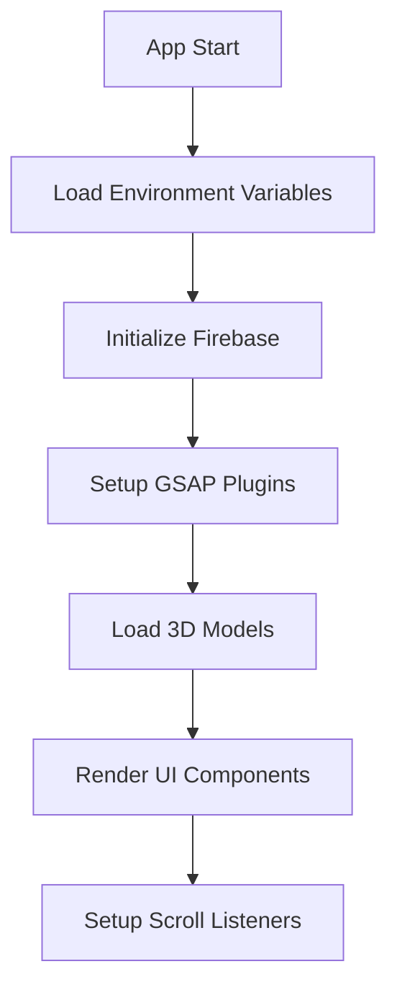
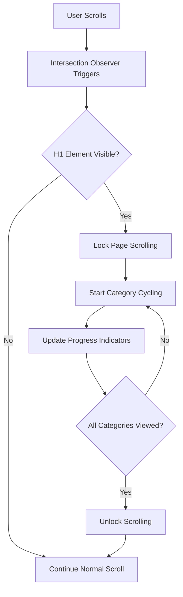
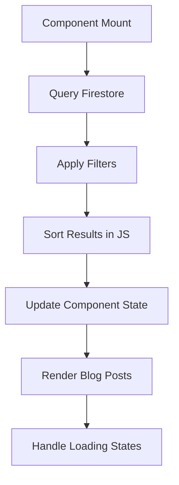

# Dhyaan - Technical Architecture

This document provides a comprehensive overview of the technical architecture, design decisions, and system components of the Dhyaan meditation platform.

## 📋 Table of Contents

- [System Overview](#-system-overview)
- [Technology Stack](#-technology-stack)
- [Architecture Patterns](#-architecture-patterns)
- [Component Architecture](#-component-architecture)
- [Data Flow](#-data-flow)
- [3D Rendering Pipeline](#-3d-rendering-pipeline)
- [Animation System](#-animation-system)
- [State Management](#-state-management)
- [Performance Optimizations](#-performance-optimizations)
- [Security Considerations](#-security-considerations)

## 🏗 System Overview

Dhyaan is a modern web application built with a component-based architecture, featuring:

- **Frontend**: React 18.3.1 with TypeScript for type safety
- **3D Graphics**: Three.js with React Three Fiber for WebGL rendering
- **Animations**: GSAP 3.13.0 for professional-grade animations
- **Backend**: Firebase for serverless infrastructure
- **Build Tool**: Vite for fast development and optimized builds
- **Styling**: Tailwind CSS for utility-first styling

### High-Level Architecture

```
┌─────────────────────────────────────────────────────────────┐
│                        Client (Browser)                     │
├─────────────────────────────────────────────────────────────┤
│  React App (TypeScript)                                     │
│  ├── UI Components (Tailwind CSS)                          │
│  ├── 3D Scene (Three.js + React Three Fiber)              │
│  ├── Animation Engine (GSAP + ScrollTrigger)               │
│  └── State Management (React Hooks + Context)              │
├─────────────────────────────────────────────────────────────┤
│                    Firebase Services                        │
│  ├── Firestore (NoSQL Database)                           │
│  ├── Storage (Asset Management)                           │
│  └── Hosting (Static Site Deployment)                     │
└─────────────────────────────────────────────────────────────┘
```

## 🛠 Technology Stack

### Frontend Technologies

| Technology | Version | Purpose | Key Features |
|------------|---------|---------|--------------|
| **React** | 18.3.1 | UI Framework | Concurrent features, Suspense, Hooks |
| **TypeScript** | 5.6.3 | Type Safety | Static typing, IntelliSense, Error prevention |
| **Vite** | 6.3.5 | Build Tool | Fast HMR, ES modules, Optimized builds |
| **Tailwind CSS** | 4.x | Styling | Utility-first, Responsive design |

### 3D & Animation

| Technology | Version | Purpose | Key Features |
|------------|---------|---------|--------------|
| **Three.js** | 0.166.1 | 3D Graphics | WebGL rendering, Geometries, Materials |
| **React Three Fiber** | Latest | React Integration | Declarative 3D, React ecosystem |
| **GSAP** | 3.13.0 | Animations | Timeline control, Scroll triggers |

### Backend & Services

| Technology | Version | Purpose | Key Features |
|------------|---------|---------|--------------|
| **Firebase** | 11.10.0 | Backend Platform | Real-time database, Authentication |
| **Firestore** | Latest | Database | NoSQL, Real-time sync, Offline support |

## 🏛 Architecture Patterns

### 1. Component-Based Architecture

```typescript
// Component hierarchy
App
├── Navbar
├── Hero
│   ├── HeroPhone (3D Model)
│   └── InteractiveStars
├── Features (Scroll-lock system)
├── Blog
│   ├── BlogPage
│   └── BlogDetail
├── Testimonial
├── Social
├── Contact
└── Footer
```

### 2. Custom Hooks Pattern

```typescript
// Custom hooks for reusable logic
const useScrollLock = () => {
  const [isLocked, setIsLocked] = useState(false);
  
  useEffect(() => {
    if (isLocked) {
      document.body.style.overflow = 'hidden';
    } else {
      document.body.style.overflow = 'auto';
    }
    
    return () => {
      document.body.style.overflow = 'auto';
    };
  }, [isLocked]);
  
  return { isLocked, setIsLocked };
};
```

### 3. Environment Configuration Pattern

```typescript
// firebase.ts - Environment-based configuration
const firebaseConfig = {
  apiKey: import.meta.env.VITE_FIREBASE_API_KEY,
  authDomain: import.meta.env.VITE_FIREBASE_AUTH_DOMAIN,
  projectId: import.meta.env.VITE_FIREBASE_PROJECT_ID,
  // ... other config
};
```

## 🧩 Component Architecture

### Core Components

#### 1. HeroPhone.tsx - 3D Model Component

```typescript
interface HeroPhoneProps {
  rotationSpeed?: number;
  autoReset?: boolean;
}

// Features:
// - Three.js iPhone model rendering
// - Controlled rotation with azimuth limits
// - Auto-reset functionality with GSAP
// - Touch/mouse interaction handling
```

#### 2. Features.tsx - Scroll-Lock System

```typescript
interface FeaturesProps {
  categories: MeditationCategory[];
}

// Features:
// - Intersection Observer for h1 detection
// - Scroll-lock mechanism
// - Category cycling with progress tracking
// - GSAP-powered smooth transitions
```

#### 3. Blog.tsx - Content Display

```typescript
interface BlogProps {
  posts: BlogPost[];
  loading?: boolean;
}

// Features:
// - Firebase Firestore integration
// - Responsive card layout
// - Hover effects with proper spacing
// - Category-based organization
```

### Component Communication

```typescript
// Parent-child communication via props
<Features 
  categories={meditationCategories}
  onCategoryChange={handleCategoryChange}
/>

// Context for global state
const AppContext = createContext<AppContextType | undefined>(undefined);

// Custom hooks for context consumption
const useAppContext = () => {
  const context = useContext(AppContext);
  if (!context) {
    throw new Error('useAppContext must be used within AppProvider');
  }
  return context;
};
```

## 🔄 Data Flow

### 1. Application Initialization



### 2. Scroll-Lock System Flow



### 3. Firebase Data Flow



## 🎮 3D Rendering Pipeline

### Three.js Setup

```typescript
// Scene composition
const scene = new THREE.Scene();
const camera = new THREE.PerspectiveCamera(75, aspect, 0.1, 1000);
const renderer = new THREE.WebGLRenderer({ 
  antialias: true,
  alpha: true 
});

// Model loading pipeline
const loader = new GLTFLoader();
loader.load('/models/scene.glb', (gltf) => {
  const model = gltf.scene;
  
  // Apply materials and textures
  model.traverse((child) => {
    if (child.isMesh) {
      child.material.envMapIntensity = 1.5;
      child.castShadow = true;
      child.receiveShadow = true;
    }
  });
  
  scene.add(model);
});
```

### React Three Fiber Integration

```typescript
// Declarative 3D scene
<Canvas camera={{ position: [0, 0, 8], fov: 75 }}>
  <ambientLight intensity={1.5} />
  <directionalLight position={[10, 10, 5]} />
  
  <Suspense fallback={<Loader />}>
    <PhoneModel 
      ref={modelRef}
      onLoad={handleModelLoad}
    />
  </Suspense>
  
  <OrbitControls
    ref={controlsRef}
    minAzimuthAngle={-0.3}
    maxAzimuthAngle={0.3}
    enableDamping
  />
</Canvas>
```

## 🎬 Animation System

### GSAP Timeline Architecture

```typescript
// Master timeline for coordinated animations
const masterTimeline = gsap.timeline();

// Category transition system
const animateCategoryChange = (newCategory: number) => {
  const tl = gsap.timeline();
  
  tl.to('.current-content', {
    duration: 0.3,
    opacity: 0,
    y: -20,
    ease: 'power2.in'
  })
  .set('.current-content', {
    textContent: categories[newCategory].name
  })
  .to('.current-content', {
    duration: 0.3,
    opacity: 1,
    y: 0,
    ease: 'power2.out'
  });
  
  return tl;
};

// Scroll-triggered animations
ScrollTrigger.create({
  trigger: '.features-section',
  start: 'top center',
  end: 'bottom center',
  onEnter: () => {
    gsap.to('.feature-cards', {
      stagger: 0.1,
      y: 0,
      opacity: 1,
      duration: 0.6
    });
  }
});
```

### Animation Performance Optimizations

```typescript
// Use transform properties for GPU acceleration
gsap.set(element, {
  willChange: 'transform',
  force3D: true
});

// Batch DOM reads and writes
gsap.batch('.animate-items', {
  onEnter: (elements) => {
    gsap.from(elements, {
      duration: 0.6,
      y: 60,
      opacity: 0,
      stagger: 0.1
    });
  }
});
```

## 🔧 State Management

### React Hooks Pattern

```typescript
// Component-level state
const Features: React.FC = () => {
  const [currentSet, setCurrentSet] = useState(0);
  const [isScrollLocked, setIsScrollLocked] = useState(false);
  const [viewedSets, setViewedSets] = useState<boolean[]>(new Array(5).fill(false));
  
  // Effect for intersection observer
  useEffect(() => {
    const observer = new IntersectionObserver(handleIntersection, {
      threshold: 0.8,
      rootMargin: '-100px 0px'
    });
    
    if (titleRef.current) {
      observer.observe(titleRef.current);
    }
    
    return () => observer.disconnect();
  }, []);
};
```

### Global State with Context

```typescript
// App-level context for shared state
interface AppContextType {
  theme: 'light' | 'dark';
  isLoading: boolean;
  user: User | null;
  setTheme: (theme: 'light' | 'dark') => void;
}

const AppProvider: React.FC<{ children: ReactNode }> = ({ children }) => {
  const [theme, setTheme] = useState<'light' | 'dark'>('light');
  const [isLoading, setIsLoading] = useState(true);
  const [user, setUser] = useState<User | null>(null);
  
  return (
    <AppContext.Provider value={{
      theme,
      isLoading,
      user,
      setTheme
    }}>
      {children}
    </AppContext.Provider>
  );
};
```

## ⚡ Performance Optimizations

### 1. Code Splitting

```typescript
// Lazy load heavy components
const BlogPage = React.lazy(() => import('./components/pages/BlogPage'));
const BlogDetail = React.lazy(() => import('./components/BlogDetail'));

// Route-based code splitting
<Routes>
  <Route path="/" element={<Home />} />
  <Route 
    path="/blogs" 
    element={
      <Suspense fallback={<Loader />}>
        <BlogPage />
      </Suspense>
    } 
  />
</Routes>
```

### 2. Asset Optimization

```typescript
// Optimized 3D model loading
const loader = new GLTFLoader();
const dracoLoader = new DRACOLoader();
dracoLoader.setDecoderPath('/draco/');
loader.setDRACOLoader(dracoLoader);

// Progressive image loading
const ImageWithFallback: React.FC<ImageProps> = ({ src, alt, fallback }) => {
  const [imageLoaded, setImageLoaded] = useState(false);
  const [imageSrc, setImageSrc] = useState(fallback);
  
  useEffect(() => {
    const img = new Image();
    img.onload = () => {
      setImageSrc(src);
      setImageLoaded(true);
    };
    img.src = src;
  }, [src]);
  
  return (
    
  );
};
```

### 3. Memoization

```typescript
// Expensive calculations
const processedBlogPosts = useMemo(() => {
  return blogPosts
    .filter(post => post.availableOnWebsite)
    .sort((a, b) => a.primaryTitle.localeCompare(b.primaryTitle))
    .slice(0, displayLimit);
}, [blogPosts, displayLimit]);

// Component memoization
const BlogCard = React.memo<BlogCardProps>(({ post, onSelect }) => {
  return (
    <div className="blog-card" onClick={() => onSelect(post.id)}>
      <h3>{post.primaryTitle}</h3>
      <p>{post.description}</p>
    </div>
  );
});
```

## 🔒 Security Considerations

### 1. Environment Variable Security

```typescript
// Client-side environment variables (prefixed with VITE_)
const config = {
  apiKey: import.meta.env.VITE_FIREBASE_API_KEY,
  authDomain: import.meta.env.VITE_FIREBASE_AUTH_DOMAIN,
  // Only expose what's necessary for client
};

// Server-side environment variables (sitemap generation)
const serverConfig = {
  projectId: process.env.FIREBASE_PROJECT_ID,
  apiKey: process.env.FIREBASE_API_KEY,
  // Server-only sensitive data
};
```

### 2. Firestore Security Rules

```javascript
// Example Firestore rules
rules_version = '2';
service cloud.firestore {
  match /databases/{database}/documents {
    // Public read access for blog posts
    match /articleFilesV1/{document} {
      allow read: if resource.data.availableOnWebsite == true;
      allow write: if request.auth != null; // Admin only
    }
  }
}
```

### 3. Content Security Policy

```html
<!-- CSP headers for security -->
<meta http-equiv="Content-Security-Policy" 
      content="
        default-src 'self';
        script-src 'self' 'unsafe-inline' *.googleapis.com;
        style-src 'self' 'unsafe-inline' fonts.googleapis.com;
        font-src 'self' fonts.gstatic.com;
        img-src 'self' data: *.firebaseapp.com;
        connect-src 'self' *.googleapis.com *.firebaseio.com;
      ">
```

## 📊 Monitoring & Analytics

### Performance Monitoring

```typescript
// Performance tracking
const trackModelLoadTime = () => {
  performance.mark('model-load-start');
  
  loader.load('/models/scene.glb', () => {
    performance.mark('model-load-end');
    performance.measure(
      'model-load-duration',
      'model-load-start',
      'model-load-end'
    );
    
    const measure = performance.getEntriesByName('model-load-duration')[0];
    console.log(`Model loaded in ${measure.duration}ms`);
  });
};

// Error boundary for React errors
class ErrorBoundary extends React.Component {
  componentDidCatch(error: Error, errorInfo: ErrorInfo) {
    console.error('Component error:', error, errorInfo);
    // Send to monitoring service
  }
}
```

## 🔄 Build & Deployment Pipeline

### Vite Configuration

```typescript
// vite.config.ts
export default defineConfig({
  plugins: [react()],
  build: {
    target: 'esnext',
    minify: 'terser',
    rollupOptions: {
      output: {
        manualChunks: {
          'three': ['three'],
          'gsap': ['gsap'],
          'firebase': ['firebase/app', 'firebase/firestore']
        }
      }
    }
  },
  optimizeDeps: {
    include: ['three', 'gsap', 'firebase/app']
  }
});
```

### Asset Pipeline

```typescript
// Asset optimization strategy
const assetPipeline = {
  images: {
    formats: ['webp', 'avif', 'jpg'],
    sizes: [320, 640, 1024, 1920],
    quality: 85
  },
  models: {
    format: 'glb',
    compression: 'draco',
    textureSize: 1024
  },
  fonts: {
    formats: ['woff2', 'woff'],
    subsetting: true
  }
};
```

---

This architecture supports a scalable, maintainable, and performant meditation platform that can grow with user needs while maintaining excellent user experience and developer productivity. 